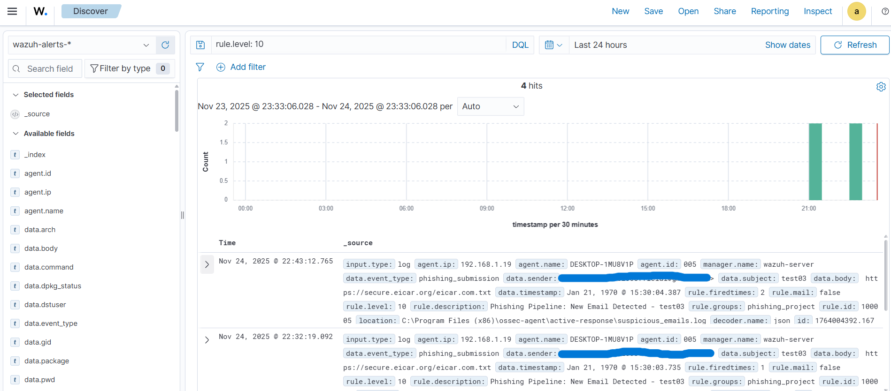
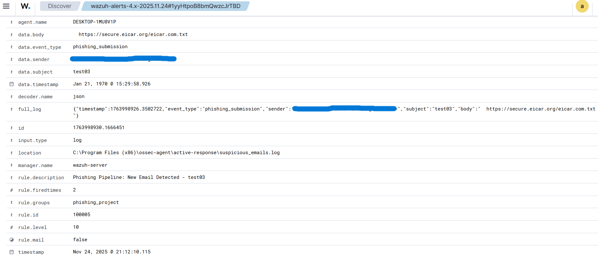
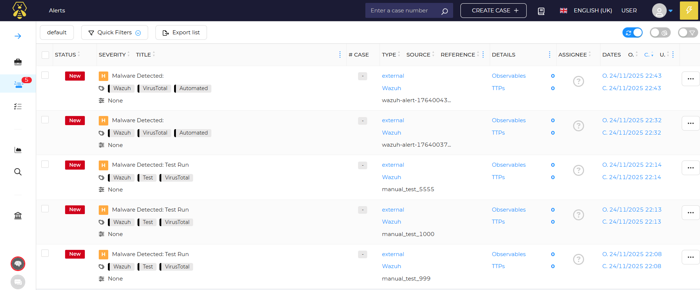
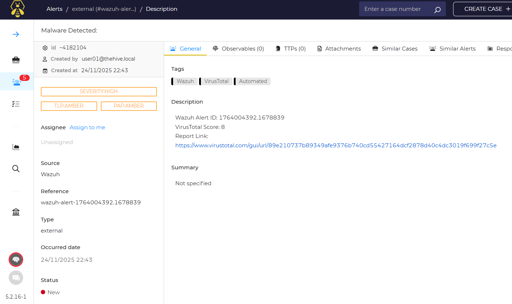

# Automated SOC Incident Response Pipeline 


## Summary
This project demonstrates a fully automated Security Operations Center (SOC) pipeline designed to ingest, analyze, and triage phishing alerts without human intervention. 

By integrating **Wazuh (SIEM)**, **Shuffle (SOAR)**, and **TheHive (Case Management)**, I engineered a workflow that reduces Mean Time to Detect (MTTD) and Mean Time to Respond (MTTR) for phishing incidents. The system automatically extracts IOCs (URLs) from email logs, scans them against threat intelligence (VirusTotal), and creates enriched case files for analysts only when true threats are detected.

---

## Architecture 

The infrastructure was deployed using a hybrid environment consisting of a Windows 11 endpoint (User Simulation) and an Ubuntu Server (Security Infrastructure).


*(Figure 1: High-level data flow from ingestion to case creation)*

### **The Workflow**
1.  **Ingestion:** A custom Python script monitors an IMAP inbox for phishing emails.
2.  **Detection:** The Wazuh Agent captures the script logs; the Wazuh Manager triggers a custom **Level 10 Rule** upon detecting specific keywords.
3.  **Orchestration:** Wazuh forwards the alert payload to **Shuffle SOAR**.
4.  **Enrichment:**
    * **Regex Extraction:** URLs are parsed from the raw log data.
    * **Defanging/Encoding:** A Python node handles Base64 encoding/padding for API compatibility.
    * **Threat Intelligence:** The URL is scanned against **VirusTotal API v3**.
5.  **Response:**
    * **Conditional Logic:** If the Malicious Score > 0, the workflow proceeds.
    * **Case Creation:** An alert is generated in **TheHive 5** with clickable reports, severity tags, and source references.

---

## Technology Stack

| Component | Technology | Function |
| :--- | :--- | :--- |
| **SIEM** | Wazuh v4.x | Log aggregation, Threat Detection, and Alerting. |
| **Endpoint** | Windows 11 + Wazuh Agent | Victim machine simulation and log generation. |
| **Ingestion** | Python + Wazuh Command Module | Custom IMAP script controlled by Wazuh Agent configuration (`<wodle>`). |
| **SOAR** | Shuffle | Workflow automation and API orchestration. |
| **Case Mgmt** | TheHive 5 (Docker) | Incident tracking and evidence storage. |
| **Threat Intel** | VirusTotal API | External reputation scanning. |

---

## Project Snapshots

### 1. Detection (Wazuh)
Custom rules trigger immediately upon email ingestion.


### 2. Automation Logic (Shuffle)
The SOAR workflow handles data cleaning, API errors (404/403 handling), and conditional routing.


### 3. The Final Alert (TheHive)
The outcome is a fully enriched ticket. Note the inclusion of the **VirusTotal Score** and **Direct Report Link** in the description.



---

## 🔧 Key Configurations & Challenges

### **1. Agent-Based Ingestion (Wodle)**
Instead of using unstable Cronjobs, I utilized the **Wazuh Command Module** to manage the Python ingestion script. This ensures the script lifecycle is tied to the Agent service.

**File:** `ossec.conf` (Windows Agent)
```xml
<wodle name="command">
  <disabled>no</disabled>
  <tag>imap_ingestor</tag>
  <command>python "C:\Program Files (x86)\ossec-agent\custom-scripts\imap_ingestor.py"</command>
  <interval>5m</interval>
  <run_on_start>yes</run_on_start>
</wodle>
```
### **2. Custom Detection Rule**
Wazuh was configured to ignore low-level noise and only forward critical email alerts to the SOAR pipeline.

File: local_rules.xml (Wazuh Manager)

```XML

<rule id="100003" level="10">
  <decoded_as>json</decoded_as>
  <field name="command">TEST_THEHIVE_PIPELINE</field>
  <description>Phishing Email Detected - Initiate SOAR</description>
  <group>custom_phishing</group>
</rule>
```
### **3. API "Padding" Challenge**
Issue: VirusTotal API rejected standard Base64 encoded URLs due to padding characters (=).

Solution: Implemented a custom Python node in Shuffle to strip padding dynamically.

```Python
# Shuffle Python Node Logic
encoded_id = base64.urlsafe_b64encode(target_url.encode()).decode().strip("=")
```

## **How to Run**
Please refer to the docs/ folder for detailed setup instructions:

**Installation Guide:** Deployment steps for Wazuh, Docker, and TheHive optimization.

**Detection Rules:** XML rules for parsing and alerting (Server & Agent side).

**Master Playbook:** Deep dive into the Shuffle automation logic and JSON mapping.

**Architecture:** Detailed network flow and infrastructure specs.

## **Future Enhancements**
While this pipeline successfully automates detection and triage, the following modules are planned for future iterations to achieve a full SOAR (Orchestration & Response) capability:

**1. Active Response (Blocking):**
Configure Wazuh Active Response to automatically block the Sender IP on the firewall if the VirusTotal malicious score exceeds 5.

**2. User Notification Loop:**
Add an SMTP node to Shuffle to email the reporting user back, informing them if the email was "Safe" or "Malicious," closing the communication loop.


## **Conclusion**
This project validates the capability to build an enterprise-grade SOC pipeline using entirely open-source technologies. By chaining Wazuh's detection capabilities with Shuffle's logic engine and TheHive's case management, I transformed a manual, high-volume task (phishing analysis) into a zero-touch automated workflow.

This architecture not only reduces analyst fatigue but also ensures consistent, rapid handling of potential threats, demonstrating a scalable approach to modern Security Operations.
