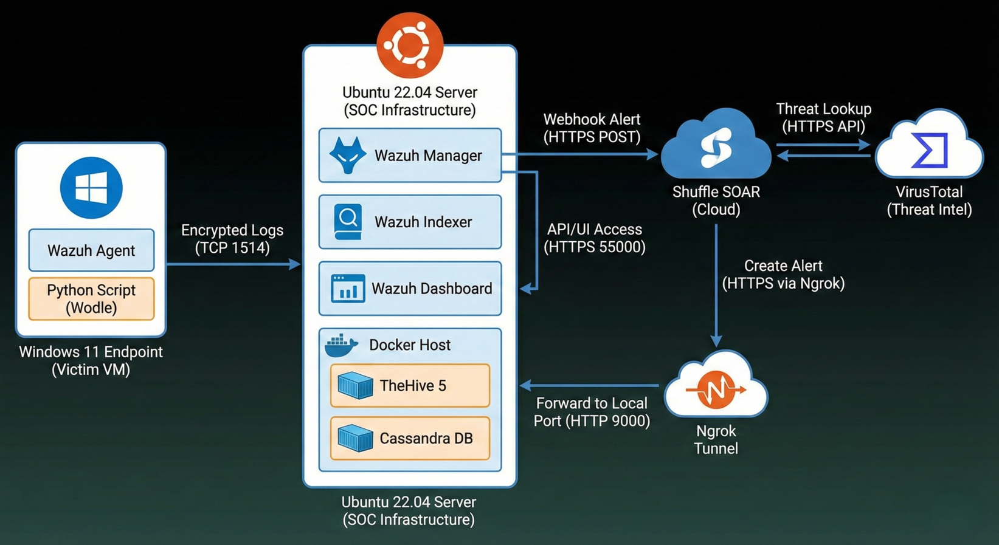

# System Architecture & Design

This document details the technical infrastructure, network flow, and resource management strategies used to build the SOC pipeline.

## 1. Infrastructure Overview

The lab operates in a **Hybrid Environment**, simulating a real-world scenario where endpoints (victims) are separated from the security infrastructure.

| Component | OS / Type | Specs | Role |
| :--- | :--- | :--- | :--- |
| **SOC Server** | Ubuntu 22.04 LTS | 4 vCPU, 8GB RAM | Wazuh and Hosts Docker containers (TheHive). |
| **Victim Endpoint** | Windows 11 | 2 vCPU, 4GB RAM | Simulates user activity and runs ingestion scripts. |
| **Automation** | Shuffle (SaaS) | Cloud | Handles logic processing to save local resources. |
| **Tunneling** | Ngrok | Service | Exposes local Docker ports to Cloud Webhooks securely. |

---

## 2. Network Data Flow

The pipeline relies on distinct protocols for each stage of the incident lifecycle.

### **Traffic Flow Diagram**
`[Windows Endpoint] --(Encrypted TCP 1514)--> [Wazuh Manager] --(HTTPS POST)--> [Shuffle Cloud] --(HTTPS Tunnel)--> [TheHive Local]`

### **Port Configuration**
| Service | Port | Protocol | Purpose |
| :--- | :--- | :--- | :--- |
| **Wazuh Agent** | 1514 | TCP | Log forwarding from Windows to Ubuntu. |
| **Wazuh API** | 55000 | HTTPS | Dashboard communication. |
| **TheHive** | 9000 | HTTP | UI Access and API endpoint for automation. |
| **Ngrok** | 443 -> 9000 | HTTPS | Secure tunnel allowing Shuffle to POST alerts to local TheHive. |

---

## 3. Resource Optimization Strategy ("The 8GB Challenge")

Running a full SIEM (Wazuh) and Case Management (TheHive) stack typically requires 16GB+ RAM. To fit this into an 8GB lab, the following optimizations were engineered:

### **1. TheHive "Diet" Config**
TheHive 5 requires Cassandra (Database) and Elasticsearch (Indexer), both Java-based memory hogs. I implemented **Hard Limits** in Docker Compose to prevent OOM (Out of Memory) kills.

* **TheHive:** Capped at `1.5GB`.
* **Cassandra:** Capped at `1.5GB` (Heap Size restricted via `MAX_HEAP_SIZE=1G`).
* **Elasticsearch:** Capped at `1.5GB` (`ES_JAVA_OPTS=-Xms1g`).

### **2. Cloud Offloading**
Instead of hosting Shuffle locally (which requires ~4GB RAM for Orborus/Workers), I utilized **Shuffle Cloud**. This shifted the processing load off the local server, reserving resources for the database heavy-lifters.

---

## 4. Component Interaction

1.  **Ingestion:** The Windows Agent runs a Python Wodle (Wrapper) every 5 minutes. Output is written to STDOUT, which Wazuh Agent captures instantly.
2.  **Normalization:** Wazuh Manager decodes the JSON log. If `rule.id == 100003`, the `integrator` daemon fires.
3.  **Orchestration:** The Integrator sends a POST request to the Shuffle Webhook.
4.  **Triage:** Shuffle processes the data. If the artifact is malicious, it calls the TheHive API.
5.  **Tunneling:** Since TheHive sits behind a NAT (Home Network), Ngrok forwards the API call from Shuffle (Internet) to `localhost:9000`.
