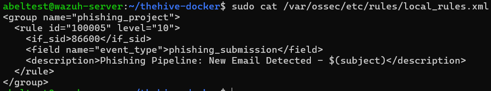
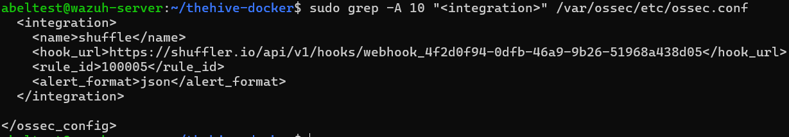

# Detection Rules & Configuration

This document outlines the specific XML configurations applied to the Wazuh ecosystem to enable custom threat detection and automated alert forwarding.

---

## 1. Custom Detection Rule (Server Side)
**Path:** `/var/ossec/etc/rules/local_rules.xml`

To detect the simulated phishing logs, a custom XML rule was created. This rule acts as the trigger for the entire SOAR pipeline. I assigned it **Level 10** to ensure it meets the threshold for automation.

**Rule Logic:**
* **ID:** 100003 (Custom range)
* **Level:** 10 (High Severity)
* **Trigger:** Matches specific JSON field or keyword string from the Python ingestor.

```xml
<group name="custom_phishing,">
  <rule id="100003" level="10">
    <decoded_as>json</decoded_as>
    <field name="command">TEST_THEHIVE_PIPELINE</field>
    <description>Phishing Email Detected - Initiate SOAR</description>
    <mitre>
      <id>T1566</id>
    </mitre>
  </rule>
</group>
```


## 2. Integration Configuration (Webhook)
Path: /var/ossec/etc/ossec.conf

Wazuh does not forward all logs to Shuffle by default. I configured the Integrator Daemon to forward alerts only when specific criteria are met to prevent API throttling and noise.

Configuration Details:

Protocol: HTTP (Webhook)

Filter: Level 10 and above (Critical Threats only)

Format: JSON (Required for Shuffle parsing)

```XML

<integration>
  <name>shuffle</name>
  <hook_url>[https://shuffler.io/api/v1/webhooks/YOUR_WEBHOOK_ID](https://shuffler.io/api/v1/webhooks/YOUR_WEBHOOK_ID)</hook_url>
  <alert_format>json</alert_format>
  <level>10</level>
</integration>
```


## 3. Ingestion Configuration (Agent Side)
Path: C:\Program Files (x86)\ossec-agent\ossec.conf (Windows 11)

To automate the execution of the Python ingestion script, I utilized the Wazuh Command Module (Wodle). This ensures the script runs as a child process of the Wazuh Agent, maintaining persistence and unified logging.

Logic:

Interval: Runs every 5 minutes.

Command: Executes the Python interpreter pointing to the custom script.

```XML

<wodle name="command">
  <disabled>no</disabled>
  <tag>imap_ingestor</tag>
  <command>python "C:\Program Files (x86)\ossec-agent\custom-scripts\imap_ingestor.py"</command>
  <interval>5m</interval>
  <ignore_output>no</ignore_output>
  <run_on_start>yes</run_on_start>
</wodle>
```
