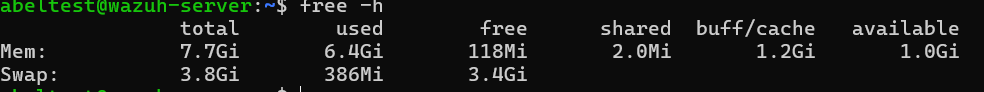
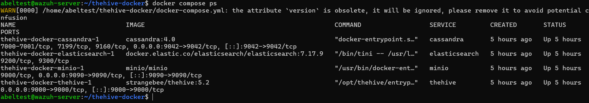
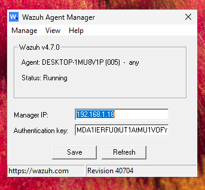
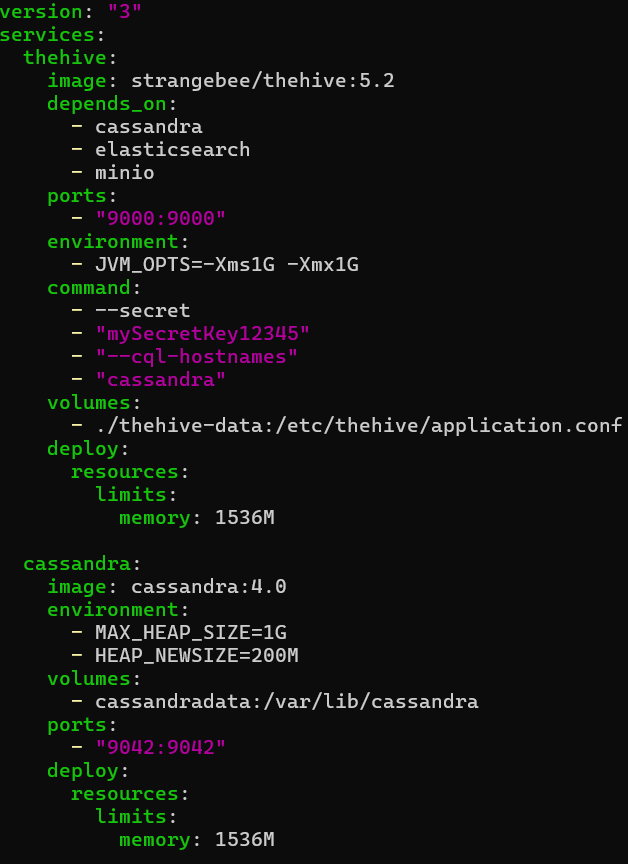
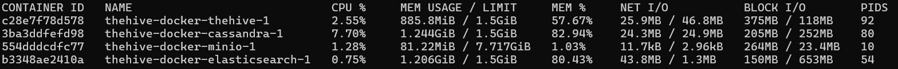
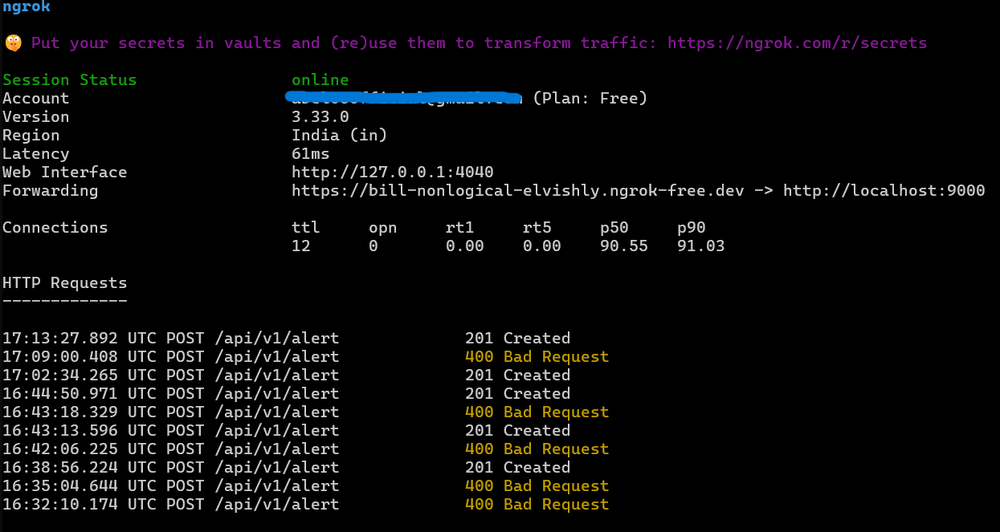

# Installation & Configuration Guide

This document details the deployment of the SOC infrastructure, including the SIEM (Wazuh), SOAR (Shuffle), and Case Management (TheHive). 

**Infrastructure Constraints:**
* **Host:** Ubuntu 22.04 LTS
* **RAM:** 8GB (Requires strict resource optimization)
* **Agent:** Windows 11 VM

---

## 1. System Preparation
Before deployment, the host system was configured to support Elasticsearch (required by both Wazuh and TheHive).

**Command:**
```bash
sysctl -w vm.max_map_count=262144
```


## 2. TheHive Deployment
Hive was deployed using Docker Compose for modularity.



### Agent Configuration (Windows 11)
The Wazuh Agent was installed on the victim machine to ingest logs. Config: C:\Program Files (x86)\ossec-agent\ossec.conf updated to point to the Wazuh Manager IP.



## 3. TheHive 5 "Diet" Configuration (Critical)
To run TheHive 5 alongside Wazuh on a single 8GB server, the standard installation was modified to prevent OOM (Out of Memory) crashes. I implemented hard memory limits for the Java-heavy containers.

Optimized docker-compose.yml snippet:

```YAML

  thehive:
    image: strangebee/thehive:5.2
    deploy:
      resources:
        limits:
          memory: 1536M  # Hard Limit to 1.5GB
  cassandra:
    image: cassandra:4.0
    environment:
      - MAX_HEAP_SIZE=1G # JVM Heap Limit
    deploy:
      resources:
        limits:
          memory: 1536M
```


### Performance Verification: 
After deployment, docker stats confirmed that the containers respected the defined limits, ensuring system stability.



## 4. Connectivity (Shuffle & Ngrok)
Since Shuffle (Cloud) requires access to the local TheHive instance, an Ngrok tunnel was established to expose the local port 9000 securely.

Command:

```Bash

ngrok http 9000
```


## 5. Post-Installation Steps
* Wazuh: Validated log ingestion from Windows 11.

* TheHive: Created org-admin user and generated API Key.

* Shuffle: Configured TheHive Node Authentication using the Ngrok URL and API Key.
