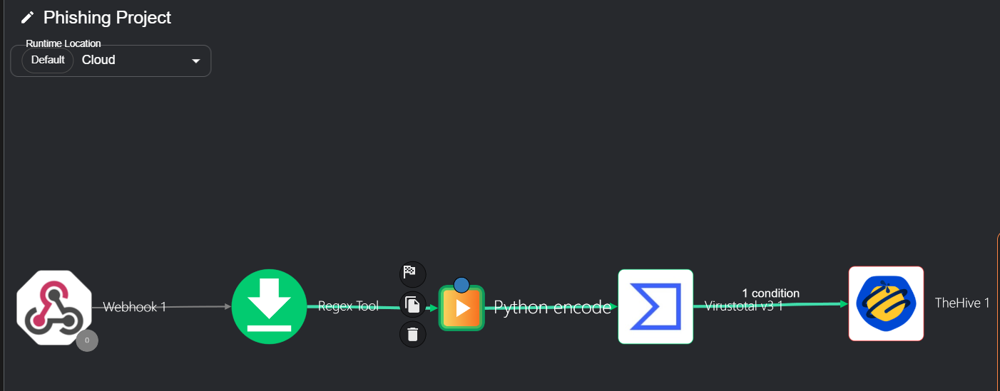
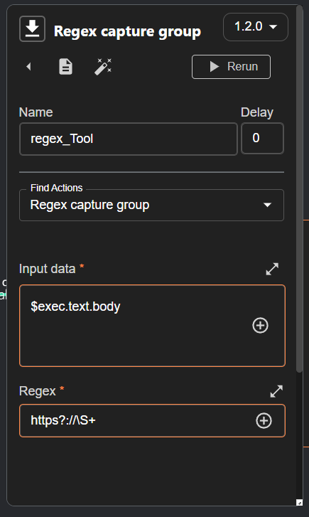
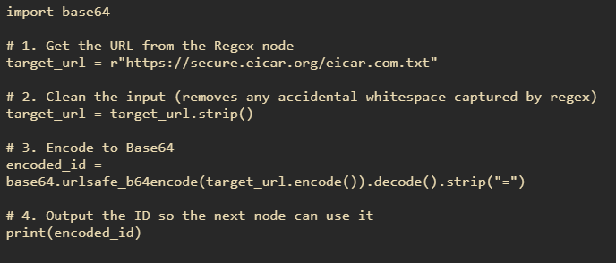
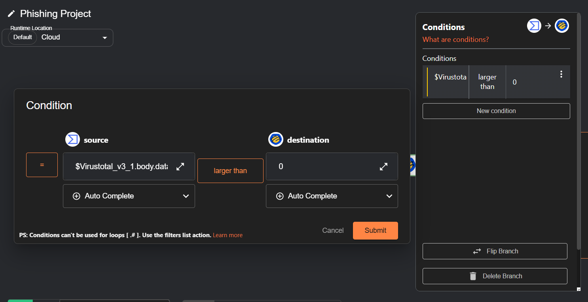
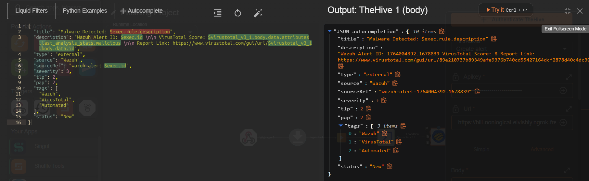

# Master Playbook: Phishing Incident Response

This document outlines the automation logic deployed in **Shuffle SOAR**. The playbook handles the end-to-end lifecycle of a phishing alert, from ingestion to case creation.

**Playbook Goal:** Automate the triage of suspicious URLs detected in email logs.

**Trigger:** Wazuh SIEM Alert (Level 10+).

---

## Workflow Overview

The workflow follows a linear pipeline with conditional branching based on threat intelligence findings.



---

## ⚙️ Step-by-Step Logic

### 1. Trigger: Webhook (Wazuh)
* **Function:** Listens for HTTP POST requests from the Wazuh Manager.
* **Input:** JSON payload containing the full log message, agent ID, and rule details (`$exec`).

### 2. URL Extraction (Regex)
* **Problem:** The log arrives as a raw string (e.g., `TEST_THEHIVE_PIPELINE: Check this url http://evil.com/malware.exe`).
* **Solution:** A Regex node extracts strictly the URL to prevent sending garbage data to the API.
* **Pattern Used:** `https?://\S+`



### 3. Data Sanitization (Python)
* **Technical Challenge:** The VirusTotal API v3 requires URLs to be Base64 encoded. However, standard Base64 libraries add padding characters (`=`) to the end of the string, which causes VirusTotal to return a `404 Not Found` error.
* **Custom Script:** A Python node was implemented to encode the URL and **strip the padding**.

```python
import base64

# Get the URL from the Regex node
target_url = r"$regex_tool.group_0.#0"

# Clean and Encode
# .strip("=") removes the padding, fixing the API 404 error
encoded_id = base64.urlsafe_b64encode(target_url.strip().encode()).decode().strip("=")

print(encoded_id)
```


### 4. Threat Intelligence (VirusTotal API)
* **Action:** Get URL Report (Not "Scan URL", to save API quota and get instant results).

* **Input:** The sanitized Base64 ID from the Python node.

* **Output:** JSON report containing reputation scores from 70+ security vendors.

## 5. Conditional Logic (The Decision)
* **Logic:** The workflow checks the malicious vote count to filter out False Positives.

* **Condition:** $virustotal_v3_1.body.data.attributes.last_analysis_stats.malicious > 0


## 6. Incident Response (TheHive 5)
* **Action:** Create Alert

* **Artifact Mapping:** The JSON payload is dynamically constructed to provide analysts with immediate context.

* **Output:** A fully enriched alert in TheHive.

